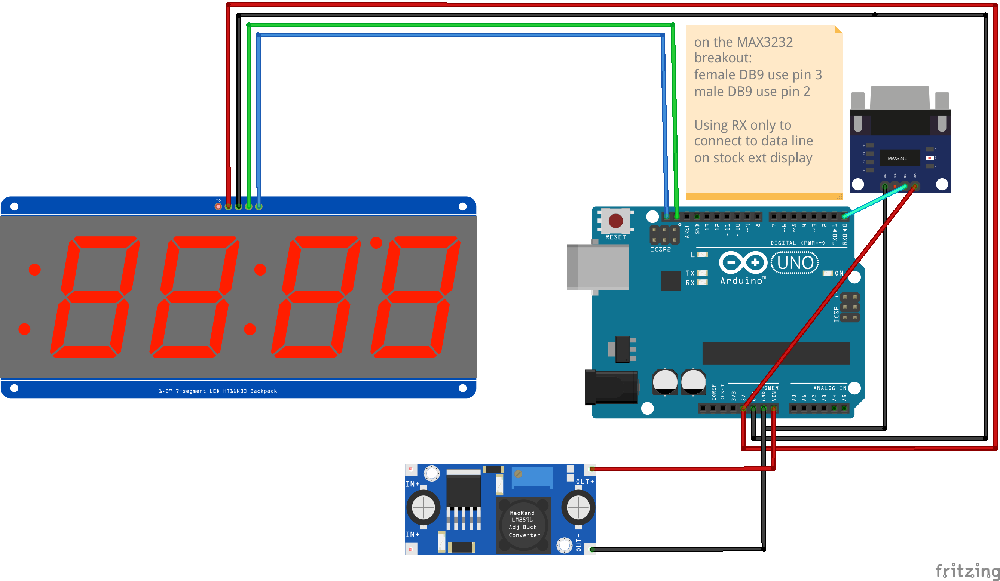

Accuvolume has an external display for reading gallons on the outside, but
sometimes it's nice to have a third display if the machine has more than
one fill port.  And also the stock Panasonic display is pretty small to
read from a distance.  This project decodes a little bit of the MODBUS data
feeding the external display to provide an additional display using the
Adafruit 1" 7 segment display backpack.  

RS232 serial data is converted using any RS232 to TTL breakout board based
on a chip like the MAX3232.  Only RX is used, and it's connected to the 
Panasonic HMI, teed into the existing "RD" wire. The RS232 DB9 ground
must be connected to the HMI "-" wire.

I also bring over the 24V "+" wire and use it to power the arduino via a
buck converter to 5v (and GND on the "-" wire).  There's plenty of power
to run this display.  But you can always use any 12V source to power the 
buck converter.

The Accovolume head unit communicates with the in-cab and external Panasonic
HMI screen using a form of MODBUS protocol over RS232.  The speed is 115200
and it's 8 bits, 1 stop bit, ODD parity.  The messages are in plain text
ascii but hex strings.  The messages that seem to have gallons in them look 
like this:

%EE$RD120014

Always the same length, first 4 digits are hex, little endian, gallons. That 
example message is 0x0012, which is 18 gallons.
