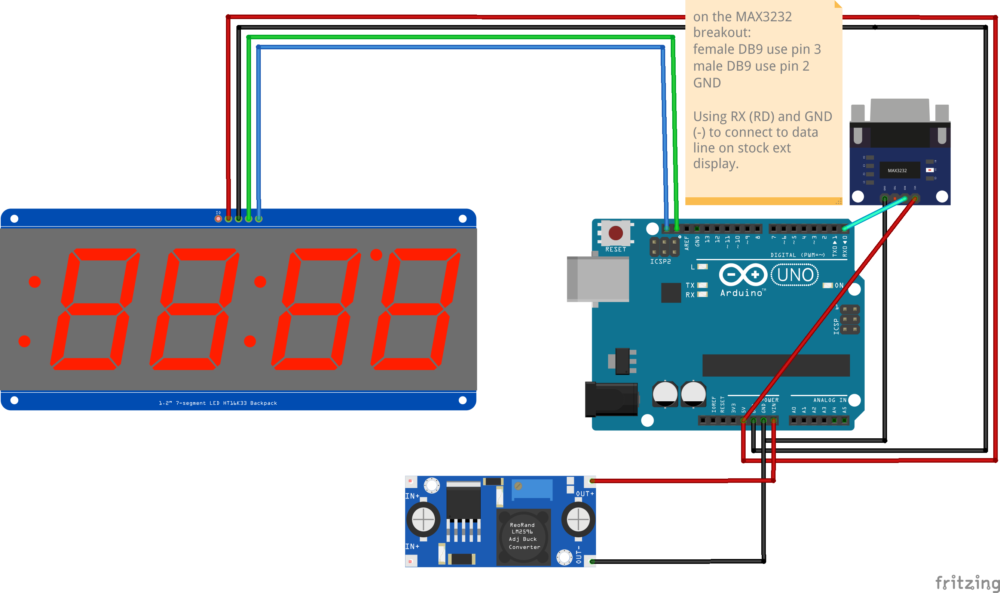

The Accovolume head unit communicates with the in-cab and external Panasonic
HMI screen using a form of MODBUS protocol over RS232.  The speed is 115200
and it's 8 bits, 1 stop bit, ODD parity.  The messages are in plain text
ascii but hex strings.  The messages that seem to have gallons in them look 
like this:

%EE$RD120014

Always the same length, first 4 digits are hex, little endian, gallons. That 
example message is 0x0012, which is 18 gallons.

